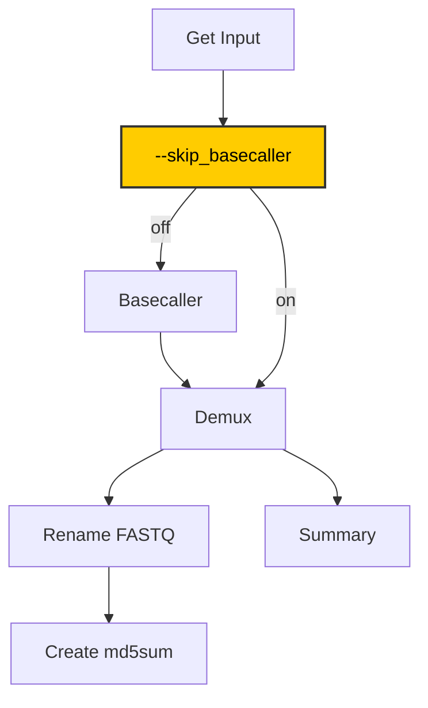

# Bacterial_Basecalling_Demux
Dorado basecalling pipeline for Nanopore sequencing data. The sequencing reads are basecalled by Dorado and demultiplexed. The the file in FASTQ file format were renamed into its common name follow by column alias of sampleSheet.csv  (sample.fastq.gz). Then, the final fastq file were move into its project_id (from column "sample_id").

## About pipeline



## TO Run This Script
```console
# To run for help
bash /data/Basecaller/dorado-0.9.0-linux-x64/script/dna_dorado090.sh -h

# To run for basecalling and demux
bash /data/Basecaller/dorado-0.9.0-linux-x64/script/dna_dorado090.sh \
    -i $PWD/POD5 \
    -o $PWD \
    -s sampleSheet.csv \
    -m sup@v5.0.0 \
    -k SQK-RBK114-96 \
    -a "--no-trim" \
    -d ' '

# To run script by skiping basecaller
bash /data/Basecaller/dorado-0.9.0-linux-x64/script/dna_dorado090.sh \
    -i $PWD/POD5 \
    -o $PWD \
    -s sampleSheet.csv \
    -m sup@v5.0.0 \
    -k SQK-RBK114-96 \
    -a "--no-trim" \
    -d ' ' \
    --skip_basecaller
``` 

## Output
The output file of `command.sh` should have a structure like this!

```console
/path/to/your/files/
├── 01.Dorado_basecall
│   ├── dorado.bam 
|   └── md5sums.txt
├── 02.Dorado_demux
│   ├── md5sums.txt
│   ├── sample_id_1
│   |  ├── alias.fastq.gz
│   |  └── ... 
│   ├── sample_id_2
│   |  ├── alias.fastq.gz
│   |  └── ...
├── sequencing_summary.txt
├── sampleSheet.csv
├── POD5
├── command.sh
└── pipeline_YYYYMMDD_HHMMSS.log
```

## Files preparation
1. create softlink of path to POD5 (optional)
2. create a doradoSheet.csv in comma-delimited file <font color="red">**(Required)**</font>

The header of `doradoSheet.csv` \
```console
experiment_id,kit,flow_cell_id,sample_id,barcode,alias
```

**experiment_id**
- Please simplified your experiment folder
- experiment_id <font color="red">**must not**</font> longer than 40 characters
- experiment_id <font color="red">**must not**</font> contain spaces and `.` (dot)
- Special character allow to use: `-` (dash) and `_` (underscore)

**kit**
- Must have prefix `"SQK-"` e.g., `SQK-RBK114-96`
- Please use the barcoding kit follow the Dorado list

**flow_cell_id**
- Flow cell ID e.g., `PAY12345`

**sample_id**
- Project ID e.g., `project_250001`

**barcode**
- Barcode numbers <font color="red">**MUST BE**</font> two-digit e.g., `barcode01`, `barcode02`, ..., `barcode96`

**alias** or **Sample name**  
- Please simplified your sample name
- Sample names <font color="red">**must not**</font> contain the substring `barcode`
- Sample names <font color="red">**must not**</font> contain spaces and `.` (dot)
- Special character allow to use: `-` (dash) and `_` (underscore)
